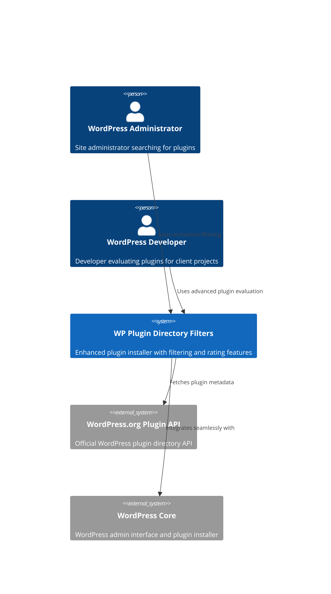
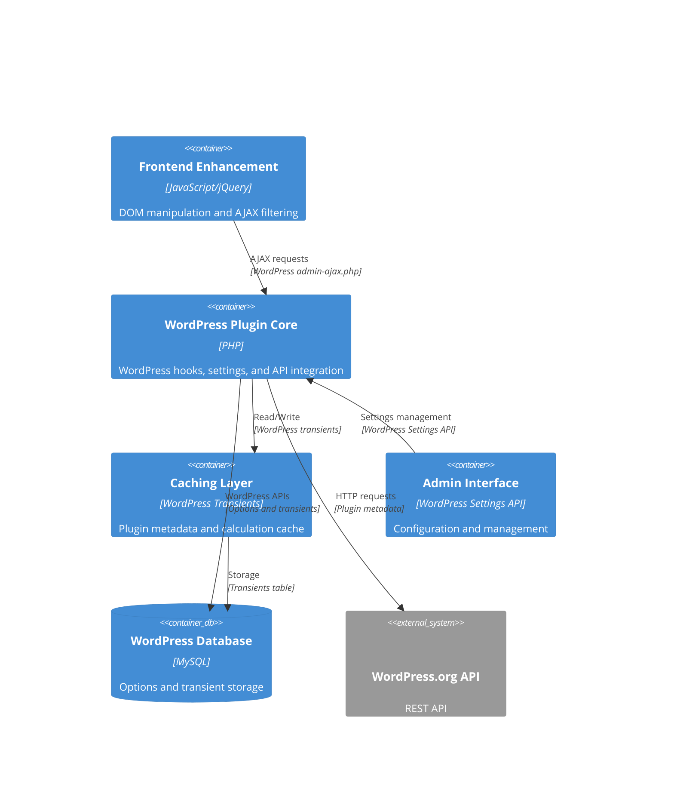
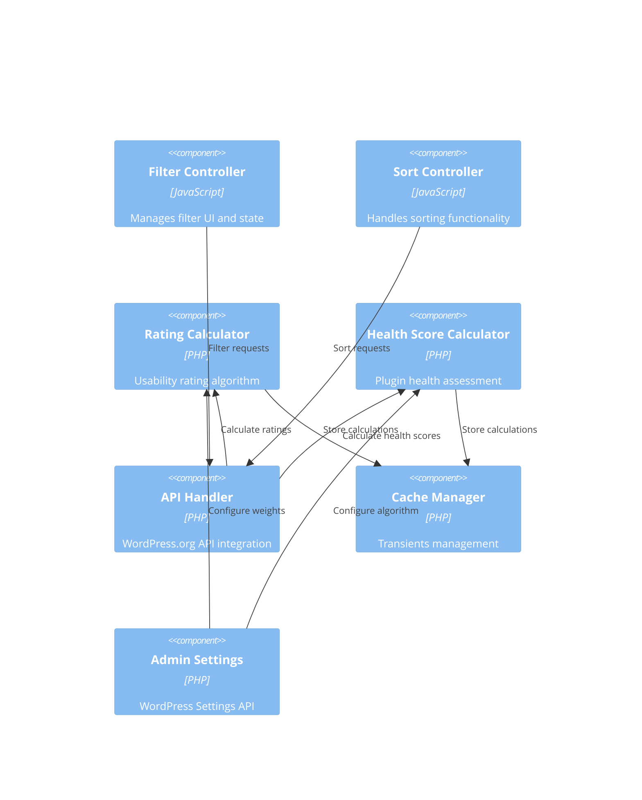
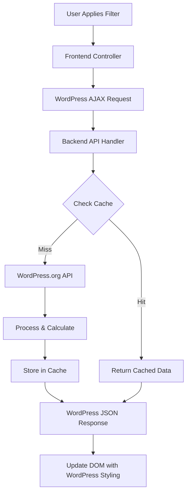

# WordPress Plugin Directory Filters - System Architecture

## Executive Summary
The WordPress Plugin Directory Filters enhancement is a WordPress plugin designed to seamlessly integrate with the existing WordPress admin plugin installer, adding advanced filtering, sorting, and rating capabilities without modifying WordPress core files. The architecture leverages WordPress hooks, the WordPress.org Plugin API, and modern JavaScript techniques to provide enhanced plugin discovery while maintaining complete visual and functional compatibility with the existing WordPress admin interface.

## Architecture Overview

### System Context


### Container Diagram


### Component Architecture


## Technology Stack

### Frontend Technology
- **JavaScript Framework**: Native JavaScript with jQuery (WordPress bundled version)
- **DOM Manipulation**: jQuery for WordPress admin compatibility
- **AJAX Framework**: WordPress admin-ajax.php with nonce verification
- **UI Components**: WordPress admin CSS classes and Dashicons
- **State Management**: URL parameters with History API
- **Event Handling**: WordPress admin event delegation patterns
- **Module Organization**: WordPress plugin JavaScript standards

### Backend Technology  
- **Runtime**: PHP 7.4+ (WordPress requirement)
- **Framework**: WordPress Plugin API and hook system
- **Database**: WordPress database abstraction ($wpdb)
- **Caching**: WordPress Transients API with object cache support
- **Authentication**: WordPress capability system and nonces
- **Configuration**: WordPress Settings API and Options API
- **Internationalization**: WordPress i18n functions and text domains

### WordPress Integration APIs
- **Hook System**: WordPress actions and filters for plugin integration
- **Admin Interface**: WordPress admin menus, pages, and form controls
- **AJAX Endpoints**: WordPress wp_ajax_* hooks for dynamic functionality
- **Caching Layer**: WordPress transients with fallback to options table
- **Security**: WordPress nonces, capability checks, and sanitization functions
- **Localization**: WordPress translation functions and RTL support

### External Dependencies
- **WordPress.org Plugin API**: RESTful API for plugin metadata
- **WordPress Core**: Admin interface hooks and styling framework
- **jQuery**: WordPress bundled version for admin compatibility
- **Dashicons**: WordPress admin icon font for UI elements

## Component Design

### Frontend Filter Controller
**Purpose**: Manages filter UI interactions and state synchronization with backend
**Technology**: JavaScript/jQuery with WordPress admin patterns
**Interfaces**: 
- Input: User filter selections, WordPress admin form events
- Output: AJAX requests to backend, DOM updates using WordPress styling
**Dependencies**: WordPress admin AJAX framework, jQuery, WordPress nonces
**Key Functions**: Filter state management, URL parameter synchronization, WordPress admin form handling

### Backend API Handler
**Purpose**: Orchestrates WordPress.org API requests and response processing
**Technology**: PHP with WordPress HTTP API and caching
**Interfaces**:
- Input: AJAX requests from frontend, WordPress.org API responses
- Output: Filtered plugin data, cached results, WordPress JSON responses
**Dependencies**: WordPress HTTP API, Transients API, WordPress.org Plugin API
**Key Functions**: API rate limiting, error handling, response caching, data sanitization

### Rating Calculator Engine
**Purpose**: Computes usability ratings based on configurable algorithm weights
**Technology**: PHP with WordPress Options API for configuration
**Interfaces**:
- Input: Plugin metadata from API, algorithm weights from settings
- Output: Calculated usability ratings (1-5 stars with decimal precision)
**Dependencies**: WordPress Options API, plugin metadata cache
**Key Functions**: Weighted scoring algorithm, edge case handling, performance optimization

### Health Score Calculator Engine
**Purpose**: Evaluates plugin maintenance quality and generates health scores
**Technology**: PHP with WordPress database abstraction and caching
**Interfaces**:
- Input: Plugin update history, compatibility data, support metrics
- Output: Health scores (0-100) with color coding and explanations
**Dependencies**: WordPress.org API data, algorithm configuration, cache layer
**Key Functions**: Multi-factor analysis, temporal calculations, score caching

### Cache Manager
**Purpose**: Optimizes performance through intelligent caching of API data and calculations
**Technology**: WordPress Transients API with object cache integration
**Interfaces**:
- Input: Plugin metadata, calculated ratings, configuration changes
- Output: Cached data retrieval, cache invalidation signals
**Dependencies**: WordPress Transients API, WordPress object cache (when available)
**Key Functions**: TTL management, cache warming, cleanup procedures, memory optimization

### Admin Settings Controller
**Purpose**: Provides configuration interface for algorithm weights and cache settings
**Technology**: WordPress Settings API with admin form components
**Interfaces**:
- Input: Administrator configuration changes, form submissions
- Output: Saved settings, algorithm updates, cache management actions
**Dependencies**: WordPress Settings API, WordPress admin interface, capability checks
**Key Functions**: Settings validation, algorithm preview, cache management, WordPress admin integration

## Data Architecture

### Data Flow Architecture


### WordPress Database Schema

#### WordPress Options Table Extensions
```sql
-- Plugin settings stored in wp_options
INSERT INTO wp_options (option_name, option_value) VALUES
('wp_plugin_filters_settings', '{"usability_weights":{"ratings":40,"count":20,"installs":25,"support":15},"health_weights":{"updates":30,"compatibility":25,"support":20,"age":15,"issues":10},"cache_duration":86400}'),
('wp_plugin_filters_version', '1.0.0');
```

#### WordPress Transients Schema (wp_options table)
```sql
-- Plugin metadata cache (24 hour TTL)
INSERT INTO wp_options (option_name, option_value, autoload) VALUES
('_transient_timeout_wp_plugin_meta_[slug]', UNIX_TIMESTAMP() + 86400, 'no'),
('_transient_wp_plugin_meta_[slug]', '{"name":"Plugin Name","installations":100000,"rating":4.5,"updated":"2024-01-15","compatibility":"6.4"}', 'no');

-- Calculated ratings cache (6 hour TTL)
INSERT INTO wp_options (option_name, option_value, autoload) VALUES
('_transient_timeout_wp_plugin_rating_[slug]', UNIX_TIMESTAMP() + 21600, 'no'),
('_transient_wp_plugin_rating_[slug]', '{"usability":4.2,"health":85,"calculated_at":"2024-01-15 12:00:00"}', 'no');

-- API response cache (1 hour TTL for search results)
INSERT INTO wp_options (option_name, option_value, autoload) VALUES
('_transient_timeout_wp_plugin_search_[hash]', UNIX_TIMESTAMP() + 3600, 'no'),
('_transient_wp_plugin_search_[hash]', '{"results":[...],"total":150,"page":1}', 'no');
```

### Data Models

#### Plugin Metadata Model
```php
<?php
class WP_Plugin_Metadata {
    public $slug;           // WordPress.org plugin slug
    public $name;           // Plugin display name
    public $version;        // Current version
    public $author;         // Plugin author
    public $rating;         // Average user rating (0-5)
    public $rating_count;   // Number of ratings
    public $installations; // Active installation count
    public $updated;        // Last update timestamp
    public $tested;         // WordPress tested up to version
    public $requires;       // Minimum WordPress version
    public $download_link;  // Plugin download URL
    public $homepage;       // Plugin homepage URL
    public $description;    // Plugin description
    public $tags;           // Plugin tags array
    
    // Calculated fields (cached separately)
    public $usability_rating;  // Calculated usability score (1-5)
    public $health_score;      // Calculated health score (0-100)
    public $last_calculated;   // When calculations were last updated
}
```

#### Algorithm Configuration Model
```php
<?php
class WP_Plugin_Algorithm_Config {
    // Usability rating weights (must sum to 100%)
    public $usability_weights = [
        'user_rating' => 40,      // Weight for existing user ratings
        'rating_count' => 20,     // Weight for number of ratings
        'installation_count' => 25, // Weight for popularity
        'support_responsiveness' => 15 // Weight for support quality
    ];
    
    // Health score weights (must sum to 100%)
    public $health_weights = [
        'update_frequency' => 30,     // Regular update pattern
        'wp_compatibility' => 25,     // WordPress version compatibility
        'support_response' => 20,     // Support ticket response rate
        'time_since_update' => 15,    // Recency of last update
        'reported_issues' => 10       // User-reported problems
    ];
    
    // Cache configuration
    public $cache_durations = [
        'plugin_metadata' => 86400,   // 24 hours for plugin data
        'calculated_ratings' => 21600, // 6 hours for calculations
        'search_results' => 3600      // 1 hour for search results
    ];
}
```

### WordPress API Integration Points

#### WordPress.org Plugin API Endpoints
```php
<?php
// Primary API endpoints used
$api_endpoints = [
    'plugin_info' => 'https://api.wordpress.org/plugins/info/1.2/',
    'plugin_search' => 'https://api.wordpress.org/plugins/info/1.2/',
    'plugin_stats' => 'https://api.wordpress.org/stats/plugins/1.0/'
];

// Request parameters for plugin search
$search_params = [
    'action' => 'query_plugins',
    'request' => [
        'search' => $search_term,
        'page' => $page_number,
        'per_page' => $per_page,
        'fields' => [
            'short_description' => true,
            'description' => false,
            'tested' => true,
            'requires' => true,
            'rating' => true,
            'ratings' => true,
            'downloaded' => true,
            'active_installs' => true,
            'last_updated' => true,
            'homepage' => true,
            'tags' => true
        ]
    ]
];
```

## Security Architecture

### WordPress Security Integration

#### Authentication & Authorization
- **Authentication method**: WordPress user sessions and capability system
- **Authorization model**: WordPress Role-Based Access Control (RBAC)
- **Capability requirements**: `install_plugins` for installer access, `manage_options` for settings
- **Multisite considerations**: Network admin capabilities for network-wide installations

#### WordPress Security Measures
- [x] HTTPS enforced through WordPress admin SSL requirements
- [x] Input validation using WordPress sanitization functions (sanitize_text_field, etc.)
- [x] SQL injection prevention using WordPress $wpdb->prepare() methods
- [x] XSS protection using WordPress escaping functions (esc_html, esc_url, etc.)
- [x] CSRF tokens using WordPress nonce system (wp_nonce_field, wp_verify_nonce)
- [x] Rate limiting through WordPress transients and request throttling
- [x] Secrets management using WordPress options with appropriate security

#### Data Sanitization Strategy
```php
<?php
// Input sanitization patterns
function sanitize_filter_input($input) {
    return [
        'installation_range' => sanitize_key($input['installation_range']),
        'update_timeframe' => sanitize_key($input['update_timeframe']),
        'rating_minimum' => floatval($input['rating_minimum']),
        'health_minimum' => intval($input['health_minimum']),
        'search_term' => sanitize_text_field($input['search_term'])
    ];
}

// Output escaping patterns
function display_plugin_data($plugin) {
    return [
        'name' => esc_html($plugin->name),
        'description' => esc_html($plugin->description),
        'author' => esc_html($plugin->author),
        'homepage' => esc_url($plugin->homepage),
        'download_link' => esc_url_raw($plugin->download_link)
    ];
}
```

### WordPress Nonce Implementation
```php
<?php
// AJAX nonce generation
wp_localize_script('wp-plugin-filters', 'wpPluginFilters', [
    'ajaxUrl' => admin_url('admin-ajax.php'),
    'nonces' => [
        'filter_plugins' => wp_create_nonce('wp_plugin_filter_action'),
        'clear_cache' => wp_create_nonce('wp_plugin_clear_cache'),
        'save_settings' => wp_create_nonce('wp_plugin_save_settings')
    ]
]);

// Server-side nonce verification
function handle_plugin_filter_ajax() {
    if (!wp_verify_nonce($_POST['nonce'], 'wp_plugin_filter_action')) {
        wp_die(__('Security check failed', 'wp-plugin-filters'));
    }
    
    if (!current_user_can('install_plugins')) {
        wp_die(__('Insufficient permissions', 'wp-plugin-filters'));
    }
    
    // Process filtered request
}
```

## Scalability Strategy

### WordPress Caching Architecture

#### Multi-Level Caching Strategy
1. **L1 Cache**: WordPress Object Cache (Redis/Memcached when available)
2. **L2 Cache**: WordPress Transients (database-backed with expiration)
3. **L3 Cache**: Browser cache for static assets (CSS, JS, images)
4. **L4 Cache**: CDN caching for WordPress.org API responses (if applicable)

#### WordPress Transients Optimization
```php
<?php
class WP_Plugin_Cache_Manager {
    private $cache_groups = [
        'plugin_meta' => 86400,      // 24 hours
        'plugin_ratings' => 21600,    // 6 hours
        'search_results' => 3600,     // 1 hour
        'api_responses' => 1800       // 30 minutes
    ];
    
    public function get_cached_plugin_data($slug) {
        // Try object cache first (if available)
        if (wp_using_ext_object_cache()) {
            $data = wp_cache_get($slug, 'plugin_metadata');
            if ($data !== false) {
                return $data;
            }
        }
        
        // Fall back to transients
        $data = get_transient("wp_plugin_meta_{$slug}");
        if ($data !== false) {
            // Store in object cache for subsequent requests
            if (wp_using_ext_object_cache()) {
                wp_cache_set($slug, $data, 'plugin_metadata', 3600);
            }
            return $data;
        }
        
        return null;
    }
    
    public function cache_plugin_data($slug, $data) {
        // Store in both object cache and transients
        if (wp_using_ext_object_cache()) {
            wp_cache_set($slug, $data, 'plugin_metadata', 3600);
        }
        set_transient("wp_plugin_meta_{$slug}", $data, $this->cache_groups['plugin_meta']);
    }
}
```

### Performance Optimization Strategies

#### WordPress Database Query Optimization
```php
<?php
// Optimized database queries using WordPress best practices
function get_cached_plugins_batch($slugs) {
    global $wpdb;
    
    $placeholders = array_fill(0, count($slugs), '%s');
    $placeholder_string = implode(', ', $placeholders);
    
    $query = $wpdb->prepare("
        SELECT option_name, option_value 
        FROM {$wpdb->options} 
        WHERE option_name IN ($placeholder_string)
        AND option_name LIKE '_transient_wp_plugin_meta_%'
    ", $slugs);
    
    return $wpdb->get_results($query);
}
```

#### JavaScript Performance Optimization
```javascript
// Debounced filter application to prevent excessive AJAX requests
const WPPluginFilters = {
    debounceTimeout: null,
    
    applyFilters: function(filterData) {
        clearTimeout(this.debounceTimeout);
        this.debounceTimeout = setTimeout(() => {
            this.executeFilterRequest(filterData);
        }, 300); // 300ms debounce
    },
    
    executeFilterRequest: function(filterData) {
        jQuery.ajax({
            url: wpPluginFilters.ajaxUrl,
            method: 'POST',
            data: {
                action: 'wp_plugin_filter',
                nonce: wpPluginFilters.nonces.filter_plugins,
                filters: filterData
            },
            beforeSend: function() {
                jQuery('.wp-filter-search .spinner').addClass('is-active');
            },
            success: function(response) {
                if (response.success) {
                    WPPluginFilters.updatePluginGrid(response.data);
                    WPPluginFilters.updateURL(filterData);
                }
            },
            complete: function() {
                jQuery('.wp-filter-search .spinner').removeClass('is-active');
            }
        });
    }
};
```

## WordPress Integration Architecture

### Hook Integration Strategy
```php
<?php
class WP_Plugin_Directory_Filters {
    public function __construct() {
        // Core WordPress hooks for plugin integration
        add_action('admin_enqueue_scripts', [$this, 'enqueue_admin_assets']);
        add_action('wp_ajax_wp_plugin_filter', [$this, 'handle_filter_request']);
        add_action('wp_ajax_wp_plugin_clear_cache', [$this, 'handle_cache_clear']);
        add_action('admin_init', [$this, 'register_settings']);
        add_action('admin_menu', [$this, 'add_admin_menu']);
        add_action('plugins_loaded', [$this, 'init_plugin']);
        
        // WordPress admin page hooks
        add_action('load-plugin-install.php', [$this, 'enhance_plugin_installer']);
        add_filter('install_plugins_table_api_args', [$this, 'modify_api_args']);
        add_filter('plugins_api_result', [$this, 'enhance_api_results']);
    }
    
    public function enhance_plugin_installer() {
        // Only enhance the plugin installer page
        add_action('admin_footer', [$this, 'inject_enhancement_javascript']);
        add_action('admin_head', [$this, 'inject_enhancement_styles']);
    }
}
```

### WordPress Admin Asset Management
```php
<?php
public function enqueue_admin_assets($hook_suffix) {
    // Only load on plugin installer pages
    if (!in_array($hook_suffix, ['plugin-install.php'])) {
        return;
    }
    
    // Enqueue JavaScript with WordPress dependencies
    wp_enqueue_script(
        'wp-plugin-filters',
        plugin_dir_url(__FILE__) . 'assets/js/plugin-filters.js',
        ['jquery', 'wp-util', 'wp-api-fetch'], // WordPress dependencies
        '1.0.0',
        true
    );
    
    // Localize script with WordPress admin data
    wp_localize_script('wp-plugin-filters', 'wpPluginFilters', [
        'ajaxUrl' => admin_url('admin-ajax.php'),
        'restUrl' => rest_url('wp-plugin-filters/v1/'),
        'nonces' => [
            'filter_plugins' => wp_create_nonce('wp_plugin_filter_action'),
            'clear_cache' => wp_create_nonce('wp_plugin_clear_cache')
        ],
        'strings' => [
            'loading' => __('Loading...', 'wp-plugin-filters'),
            'error' => __('An error occurred. Please try again.', 'wp-plugin-filters'),
            'noResults' => __('No plugins found matching your criteria.', 'wp-plugin-filters')
        ]
    ]);
    
    // Enqueue CSS with WordPress admin styling
    wp_enqueue_style(
        'wp-plugin-filters',
        plugin_dir_url(__FILE__) . 'assets/css/plugin-filters.css',
        ['wp-admin', 'dashicons'], // WordPress admin dependencies
        '1.0.0'
    );
}
```

## Deployment Architecture

### WordPress Plugin Structure
```
wp-plugin-directory-filters/
├── wp-plugin-directory-filters.php    # Main plugin file with WordPress headers
├── includes/
│   ├── class-plugin-core.php         # Core plugin functionality
│   ├── class-api-handler.php         # WordPress.org API integration
│   ├── class-rating-calculator.php   # Usability rating algorithm
│   ├── class-health-calculator.php   # Health score algorithm
│   ├── class-cache-manager.php       # WordPress caching integration
│   ├── class-admin-settings.php      # WordPress Settings API integration
│   └── class-ajax-handler.php        # WordPress AJAX endpoint handlers
├── admin/
│   ├── css/
│   │   └── admin-styles.css          # WordPress admin compatible styles
│   ├── js/
│   │   └── admin-scripts.js          # WordPress admin JavaScript
│   └── partials/
│       └── admin-settings.php        # WordPress admin settings page template
├── languages/
│   └── wp-plugin-filters.pot         # WordPress translation template
├── assets/
│   └── screenshots/                  # WordPress.org repository screenshots
├── readme.txt                        # WordPress.org plugin readme
└── composer.json                     # PHP dependencies (if any)
```

### WordPress Plugin Headers
```php
<?php
/**
 * Plugin Name: WordPress Plugin Directory Filters
 * Plugin URI: https://wordpress.org/plugins/wp-plugin-directory-filters
 * Description: Enhances the WordPress admin plugin installer with advanced filtering, sorting, and rating capabilities while maintaining seamless integration with the existing interface.
 * Version: 1.0.0
 * Author: Plugin Author
 * Author URI: https://example.com
 * License: GPL-2.0-or-later
 * License URI: https://www.gnu.org/licenses/gpl-2.0.html
 * Text Domain: wp-plugin-filters
 * Domain Path: /languages
 * Requires at least: 5.8
 * Tested up to: 6.4
 * Requires PHP: 7.4
 * Network: true
 */

// Prevent direct access
if (!defined('ABSPATH')) {
    exit;
}

// Plugin constants
define('WP_PLUGIN_FILTERS_VERSION', '1.0.0');
define('WP_PLUGIN_FILTERS_PLUGIN_DIR', plugin_dir_path(__FILE__));
define('WP_PLUGIN_FILTERS_PLUGIN_URL', plugin_dir_url(__FILE__));

// Initialize plugin
function wp_plugin_filters_init() {
    require_once WP_PLUGIN_FILTERS_PLUGIN_DIR . 'includes/class-plugin-core.php';
    WP_Plugin_Directory_Filters::get_instance();
}
add_action('plugins_loaded', 'wp_plugin_filters_init');
```

### WordPress Installation and Activation
```php
<?php
class WP_Plugin_Directory_Filters {
    public function __construct() {
        register_activation_hook(__FILE__, [$this, 'activate']);
        register_deactivation_hook(__FILE__, [$this, 'deactivate']);
        register_uninstall_hook(__FILE__, [__CLASS__, 'uninstall']);
    }
    
    public function activate() {
        // Create default settings using WordPress Options API
        $default_settings = [
            'usability_weights' => [
                'user_rating' => 40,
                'rating_count' => 20,
                'installation_count' => 25,
                'support_responsiveness' => 15
            ],
            'health_weights' => [
                'update_frequency' => 30,
                'wp_compatibility' => 25,
                'support_response' => 20,
                'time_since_update' => 15,
                'reported_issues' => 10
            ],
            'cache_duration' => 86400
        ];
        
        add_option('wp_plugin_filters_settings', $default_settings);
        add_option('wp_plugin_filters_version', WP_PLUGIN_FILTERS_VERSION);
        
        // Schedule cache cleanup cron job
        if (!wp_next_scheduled('wp_plugin_filters_cleanup')) {
            wp_schedule_event(time(), 'daily', 'wp_plugin_filters_cleanup');
        }
    }
    
    public function deactivate() {
        // Clear scheduled events
        wp_clear_scheduled_hook('wp_plugin_filters_cleanup');
    }
    
    public static function uninstall() {
        // Clean up options and transients
        delete_option('wp_plugin_filters_settings');
        delete_option('wp_plugin_filters_version');
        
        // Clear all plugin-related transients
        global $wpdb;
        $wpdb->query("DELETE FROM {$wpdb->options} WHERE option_name LIKE '_transient_wp_plugin_%'");
        $wpdb->query("DELETE FROM {$wpdb->options} WHERE option_name LIKE '_transient_timeout_wp_plugin_%'");
    }
}
```

## Monitoring & Observability

### WordPress Debug Integration
```php
<?php
class WP_Plugin_Debug_Logger {
    public static function log($message, $context = []) {
        if (defined('WP_DEBUG') && WP_DEBUG && defined('WP_DEBUG_LOG') && WP_DEBUG_LOG) {
            $log_entry = sprintf(
                '[WP Plugin Filters] %s | Context: %s',
                $message,
                wp_json_encode($context)
            );
            error_log($log_entry);
        }
    }
    
    public static function log_api_request($endpoint, $params, $response_time) {
        self::log('API Request', [
            'endpoint' => $endpoint,
            'params' => $params,
            'response_time' => $response_time . 'ms'
        ]);
    }
    
    public static function log_cache_stats($operation, $key, $hit_rate = null) {
        self::log('Cache Operation', [
            'operation' => $operation,
            'key' => $key,
            'hit_rate' => $hit_rate
        ]);
    }
}
```

### WordPress Admin Performance Monitoring
```php
<?php
class WP_Plugin_Performance_Monitor {
    private $start_time;
    private $memory_start;
    
    public function start_monitoring() {
        $this->start_time = microtime(true);
        $this->memory_start = memory_get_usage(true);
    }
    
    public function log_performance($operation) {
        $execution_time = (microtime(true) - $this->start_time) * 1000; // ms
        $memory_usage = memory_get_usage(true) - $this->memory_start;
        
        // Log to WordPress debug if performance thresholds exceeded
        if ($execution_time > 2000 || $memory_usage > 5242880) { // 2s or 5MB
            WP_Plugin_Debug_Logger::log('Performance Warning', [
                'operation' => $operation,
                'execution_time' => $execution_time . 'ms',
                'memory_usage' => size_format($memory_usage)
            ]);
        }
    }
}
```

## WordPress Multisite Considerations

### Network Administration Support
```php
<?php
class WP_Plugin_Multisite_Handler {
    public function __construct() {
        if (is_multisite()) {
            // Network admin hooks
            add_action('network_admin_menu', [$this, 'add_network_admin_menu']);
            add_action('wp_ajax_wp_plugin_network_settings', [$this, 'handle_network_settings']);
            
            // Site admin hooks with network override capability
            add_action('admin_init', [$this, 'check_network_override']);
        }
    }
    
    public function add_network_admin_menu() {
        add_submenu_page(
            'settings.php',
            __('Plugin Directory Filters', 'wp-plugin-filters'),
            __('Plugin Filters', 'wp-plugin-filters'),
            'manage_network_options',
            'wp-plugin-filters-network',
            [$this, 'render_network_settings_page']
        );
    }
    
    public function check_network_override() {
        $network_settings = get_site_option('wp_plugin_filters_network_settings');
        if ($network_settings && $network_settings['override_site_settings']) {
            // Network settings override site settings
            add_filter('pre_option_wp_plugin_filters_settings', function() use ($network_settings) {
                return $network_settings;
            });
        }
    }
}
```

## Architectural Decisions (ADRs)

### ADR-001: WordPress Hook-Based Architecture
**Status**: Accepted
**Context**: Need to enhance WordPress plugin installer without modifying core files
**Decision**: Use WordPress hook system exclusively for all integrations
**Consequences**: 
- Positive: Maintains WordPress update compatibility, follows WordPress best practices
- Negative: Limited to available WordPress hooks, some functionality requires JavaScript DOM manipulation
**Alternatives Considered**: Core file modification (rejected due to update issues), standalone interface (rejected due to UX inconsistency)

### ADR-002: WordPress Transients for Caching
**Status**: Accepted
**Context**: Need efficient caching that works across different WordPress hosting environments
**Decision**: Use WordPress Transients API as primary caching layer with object cache integration
**Consequences**:
- Positive: Automatic cleanup, multisite compatible, object cache integration when available
- Negative: Database storage for non-object-cache environments may impact performance
**Alternatives Considered**: File-based caching (rejected due to hosting restrictions), external cache services (rejected due to complexity)

### ADR-003: JavaScript DOM Manipulation Strategy
**Status**: Accepted
**Context**: Need to enhance existing WordPress admin interface without breaking functionality
**Decision**: Use non-intrusive JavaScript to inject additional UI elements and functionality
**Consequences**:
- Positive: Preserves all existing WordPress functionality, seamless visual integration
- Negative: Dependent on WordPress admin DOM structure stability, requires careful CSS specificity management
**Alternatives Considered**: Replace entire interface (rejected due to UX disruption), WordPress REST API only (rejected due to limited admin integration)

### ADR-004: WordPress Settings API Integration
**Status**: Accepted
**Context**: Need administrative configuration interface that follows WordPress standards
**Decision**: Use WordPress Settings API for all configuration management
**Consequences**:
- Positive: Automatic form handling, validation, and security; consistent with WordPress admin
- Negative: Limited to WordPress Settings API capabilities and styling
**Alternatives Considered**: Custom admin interface (rejected due to maintenance overhead), WordPress Customizer integration (rejected due to context mismatch)